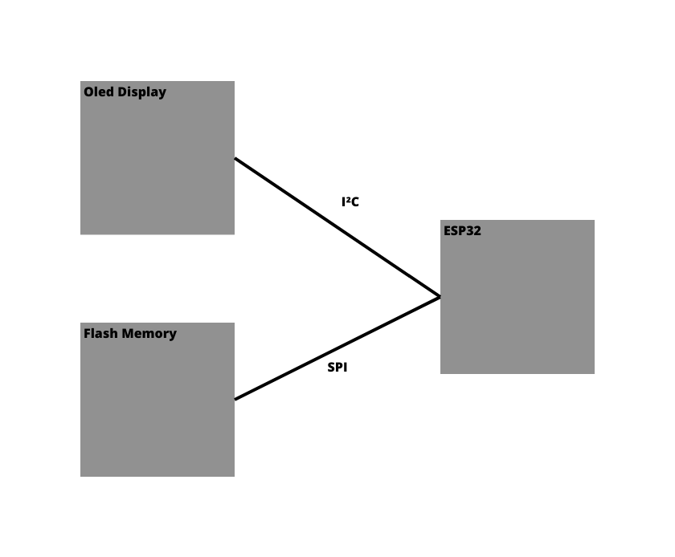
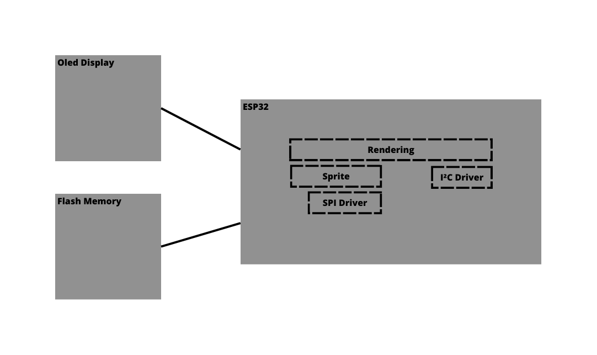

# OLed using ESP32 Example

In this repository we implement a simple animation in the OLed to learn more how to use I²C communication using ESP32.

The main animation is a Snake in the display.

-- Explication about esp32

-- Explication about OLed

-- Explication about communication

The project Hardware and Software is defined in the next diagram:

    
    

