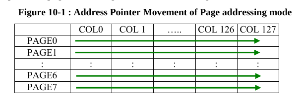
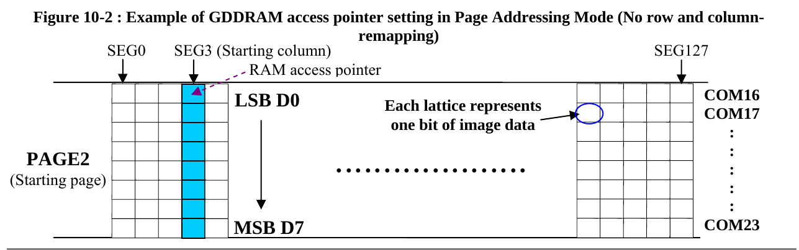

# I²C SSD1306

Slave Address Bit `SAO`.  
I²C-bus data signal `SDA` (SDA_OUT/D2 for output and SDA_IN/D1 for input) -> Pull-Up Resistors.  
I²C-bus clock Signal `SCL` -> Pull-Up Resistors

SSD1306 recognize the Slave address before transmitting or recieving any information.

Slave Address: `0b011110X⁰X¹`, where X⁰ is any 0 or 1, and X¹ is 1 for read and 0 for Write. 

Every bit is read in the **Clock UP**.

// TODO: Will we have a read option?

## Write Mode

Sent in order to achieve communication

1. Start condition:
    - SDA: HIGH -> LOW
    - SCL: HIGH
1. Slave Address: `0b011110X⁰0` with R/W# bit == 0 to write mode
1. Acknowledgement signal will be generated after receiving one byte of data. On the ninth UP clock pulse after 8 bits.
1. Next will be sent a control byte or data byte which consists of `Co-D/C#-0-0-0-0-0-0`
    - If Co is 0, the next informatiion will be data bytes only.
    - The D/C# bit determines the next data byte is acted as a comamand or data. 0: The next byte is a command. 1: The next byte is a data byte which will be stored into GDDRAM column.
1. Again we will have an acknowledge bit after receiving each control byte or data byte.
1. The write mode will be finished when there's a stop condition.
    - SDA: LOW -> HIGH
    - SCL: HIGH.

## Commands

Each command will be sent after a `0b00000000` and a ack bit.

*To see full tables of commands, read Section 9 of SSD1306 datasheet.*

## Data

Each data byte will be sent after a `0b01000000` and a ack bit.

# How Graphics Works

We put data into the GDDRAM that is going to be displayed into the OLed. The size of the RAM is 128x64 bits and is divided into 8 pages.

When one byte of data is sent, all the rows of the same page are filled with the byte sent. With the register that has a pointer to the column. Important: Data bit D0 is written in the top row, while data bit D7 is written into bottom row.

Can draw inside RAM using three methods:

 - Page addressing mode
 - Horizontal addressing mode
 - Vertical addressing mode

## Page Addressing A[1:0]=10xb

The data are written inside each page, after each row-page data, the column index is increased by one. The pages should be changed by the user usiing the `Bxh` command. Next we have a step-by-step tutorial to set a value to a page.

1. Set the page start address of the target display location by command B0h to B7h.
1. Set the lower start column address of pointer by command 00h~0Fh.
1. Set the upper start column address of pointer by command 10h~1Fh.

**In this project, the developer choosed to use the paging method, since it's easier to use and fast enough to the problem.**

# Reset Circuit

1. Display is OFF
1. 128x64 Display mode (How to change display mode?)
1. Normal segment and display data column address and row address mapping (SEG0 mapped to address 00h and COM0 mapped to address 00h)
1. Display start line is set at display RAM address 0
1. Shift register data clear in serial interface
1. Column address counter is set at 0
1. Normal scan direction of the COM outputs
1. Contrast control register is set at 7Fh
1. Normal display mode (Equivalent to A4h command)